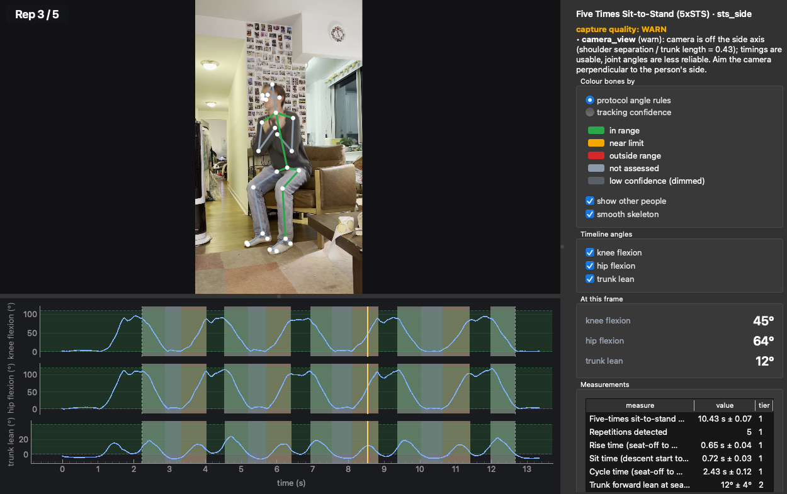

# pt-vision

Motion tracking for PT movement tests from phone video



## SETUP

**macOS**
(assumes you have git already)
```sh
git clone https://github.com/rkoren/pt-vision.git && cd pt-vision
./scripts/setup-mac.sh
uv run ptv demo
```

**Windows (PowerShell)**
(haven't tried this yet)

```powershell
git clone https://github.com/rkoren/pt-vision.git; cd pt-vision
powershell -ExecutionPolicy Bypass -File scripts\setup-windows.ps1
uv run ptv demo
```

The scripts install `uv` and `ffmpeg` if missing, then run the install

```sh
uv sync --extra app --extra datasets
```

It installs the app, the dataset tools and the test dependencies together, so there is no separate
developer install and re-running it never removes anything.

## Try your own video

Film from a person's **side** with the phone on a tripod (or held still), the whole body in
frame, and keep recording two seconds after the last movement. Portrait or landscape, then:

```sh
uv run ptv app
```

Drop the file into the window (or click "Open video"), pick the protocol (`sts_5x` for a
five-times sit-to-stand test, `sts_30s` for a 30-second chair stand, "Pose only" for skeleton
tracking of anything), and optionally type the person's height, age and sex, and watch. 
Then again from the command line:

```sh
uv run ptv app clip.MOV --protocol sts_5x
uv run ptv analyze clip.MOV --protocol sts_5x --age 71 --height-m 1.68 --sex f   # report only
```

Filming guide with what the quality checks look at: [`docs/capture-guides/sts.md`](docs/capture-guides/sts.md).

## What it measures

`sts_5x` / `sts_30s`: Five-Times Sit-to-Stand and 30-second chair stand (phase segmentation,
timing and count with error bars, trunk/knee angles, age-band reference values), with
capture-quality gating. Walking (gait events, cadence, speed) we can work on next.

| Tier | Examples | Typical error (est) |
|---|---|---|
| 1 | sit-to-stand time and count (now); gait speed, cadence, stance/swing time (next) | 0.01–0.04 s, 0.02–0.04 m/s |
| 2 | peak side (sagittal) knee/hip flexion, step length, knee/elbow/shoulder ROM | 4–6° RMSE, <2 cm |
| 3 | ankle angles, frontal-plane hip/pelvis, absolute upper-limb ROM | not reported as values |

## Validation so far

`notebooks/validation.ipynb` goes through what has been checked and lets you rerun it: the sample
clip against a stopwatch, tracking with the body partly out of frame, and 200 motion-capture
sit-to-stand episodes (Idaho dataset) through the same segmenter. After the install above:

```sh
uv run ptv datasets pull uiprmd
uv run --with jupyter jupyter lab notebooks/validation.ipynb
```

## Public datasets

`uv run ptv datasets list` shows the public motion-capture datasets we can validate against (0.4 to
56 GB each, CC BY / CC0 / PDDL). `uv run ptv datasets pull schreiber2019` fetches the smallest
(0.4 GB, about five minutes) with checksums into `~/ptvision-data/datasets/`
(`PTV_DATASETS_DIR` to move it). Which datasets exist, what they are for, how the evaluations are run,
and the ones that need a manual download are in [`docs/datasets.md`](docs/datasets.md).

## Develop

The setup above is the whole development environment. Install the git hooks once, so formatting
and lint run on every commit (this is what keeps `main` green):

```sh
uv run pre-commit install
```

Useful commands:

```sh
uv run ptv version                                            # python, onnxruntime, model and data dirs
uv run ptv models pull --mode lightweight                     # small weights the model tests use
uv run pytest -m "not model"                                  # fast suite, about 30 s, no weights needed
uv run pytest                                                 # full suite, including the model tests
uv run ruff check . && uv run ruff format . && uv run mypy src
```

## Layout

```
src/ptvision/
  video.py     video probe, ffmpeg normalization, frame access; files.py: hashing and JSON helpers
  pose/        PoseBackend protocol, rtmlib backend, PoseTrack data (track.py), person identity
               across frames (identity.py), overlay drawing
  kinematics/  filtering, joint angles, pixel-to-metre scale, TRC/MOT export
  clinical/    protocols (TOML), segmenters, metric registry, reference tables
  quality/     capture-quality gating
  report/      JSON report bundle + HTML rendering
  pipeline.py  the stages in order; entry points pose_only, analyze, run_pose
  viz/         shared status → colour semantics and skeleton segments (CLI overlay and app)
  app/         PySide6 desktop viewer (optional `app` extra): pages, viewer, worker
  trials/      the trial store on disk: capture.json, runs/<id>/provenance.json
  datasets/    public-dataset manifest, pull, c3d reader, sit-to-stand evaluation
  samples/     the bundled demo clip
  cli/         `ptv` command line (main, datasets, records)
  _vendor/     BSD-3 code vendored from Pose2Sim
```

## Licensing

Public domain (Unlicense) for original code; vendored and adapted third-party code keeps its own
permissive license, listed in `NOTICE`.
