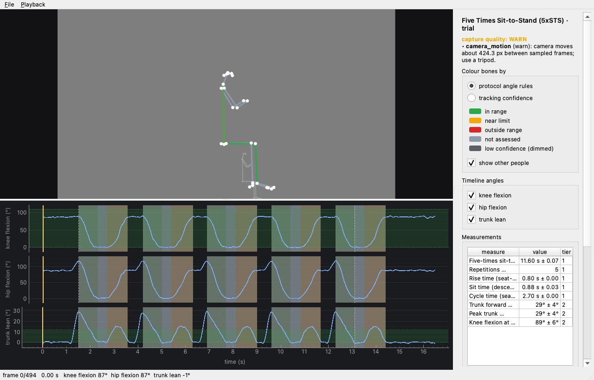
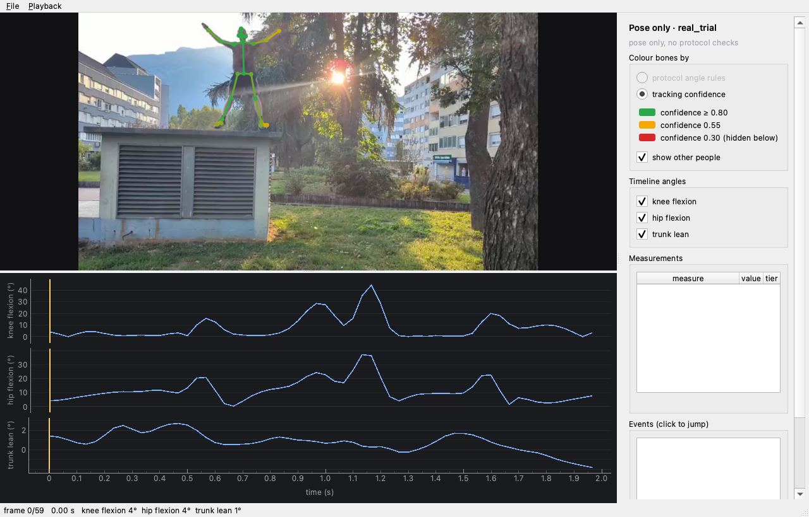
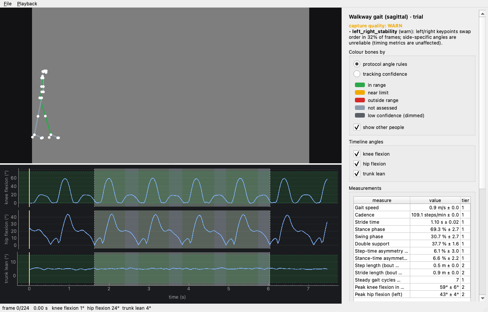

# Desktop viewer

`uv sync --extra app --group qt` then `uv run ptv app [video | trial folder]`.

- Drop a video (or a trial folder) into the window, pick a protocol (Pose only, `sts_5x`, `sts_30s`),
  and watch progress. Cancel is a real cancel.
- Playback: Space play/pause, ←/→ one frame, ⇧←/→ ten frames, Home/End (or ⌘←/→) first/last, F fit,
  C toggle colour mode, mouse wheel zooms, drag pans when zoomed.
- Bones are coloured on one shared gradient (`ptvision.viz.status`):
  - *Rules*: green inside the protocol's angle band, amber at the warn edge, red beyond; grey-blue for
    bones no rule assesses (the far side, the head); dimmed when tracking confidence is low.
  - *Confidence*: green ≥ 0.80, amber 0.55, red at 0.30; bones below 0.30 are not drawn.
- The timeline shows the selected angles with sit-to-stand phases shaded (rise green, stand blue,
  descent orange), the rule's ok band in translucent green, the timed window as dashed lines, and a
  draggable playhead. Click anywhere on it, or an event in the side panel, to jump.

Screenshots were taken with `PTV_APP_SCREENSHOT=<png> ptv app <trial>` on the offscreen platform,
which is also how CI exercises the widgets (`tests/app`, pytest-qt).

For gait trials the timeline shades stance (green) and swing (blue) of the side with the most steady
cycles, the dashed lines mark the steady-state window, and the events list holds every heel strike and
toe-off by side.
